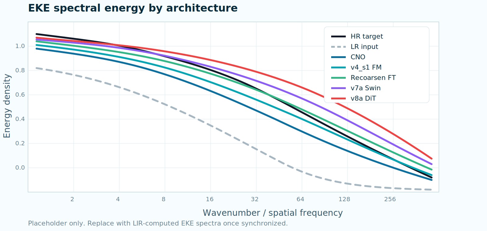

::: {.research-home}
::: {.research-hero}

These pages document the experiments I ran to identify a reliable architecture for ocean super-resolution:
from a deterministic CNO baseline to residual Flow Matching, fine-tuning strategies, transformers and
diffusion-style alternatives.

:::

## Residual Decomposition

The project is organized around a Reynolds-like decomposition of the high-resolution ocean state:

::: {.formula-strip}
xHR
<strong>=</strong>
mu(xLR)
<strong>+</strong>
runresolved
:::

where the deterministic component is learned by a CNO and the residual component is modeled generatively.

::: {.decomposition}
::: {.decomp-source}
### High-resolution state

`x_HR`

Five surface variables on the GLORYS-like HR grid.
:::

::: {.decomp-arrow}
→
:::

::: {.decomp-branch .deterministic}
### [Deterministic branch: CNO](cno.html)

`mu = x_LR + f_CNO(x_LR)`

Learns the stable large-scale correction and produces the conditional mean field.
:::

::: {.decomp-plus}
+
:::

::: {.decomp-branch .stochastic}
### [Generative branch: Flow Matching](flow-matching.html)

`r = FM(z, t, mu, x_LR)`

Learns the unresolved residual that the deterministic branch cannot recover.
:::
:::

## Data Construction

::: {.data-flow}
::: {.data-step}
01

### GLORYS12 HR: 1/12°

Daily surface fields from `1994–2003` are used for training and `2004` for validation.
The variables are `thetao`, `so`, `zos`, `uo`, and `vo`.
:::

::: {.data-operator}
coarsen <small>offline degraded product</small>
:::

::: {.data-step}
02

### Coarse product: 1.5°

The training pipeline reads the already degraded 1.5° product from disk. This is the coarse ocean state before
any HR-grid alignment.
:::

::: {.data-operator}
interpolate <small>PyTorch nearest</small>
:::

::: {.data-step}
03

### LR input: 1/4° grid

The 1.5° field is aligned with the 1/4° tensors using `torch.nn.functional.interpolate(mode="nearest")`.
This gives the model a coarse, HR-shaped condition.
:::

::: {.data-operator}
learn
:::

::: {.data-step}
04

### Learning targets: HR grid

CNO learns `HR - LR`. Flow Matching learns `HR - mu`, where `mu = LR + CNO(LR)`.
:::
:::

## Training Logic

::: {.training-logic}
::: {.logic-panel}
### CNO baseline

::: {.formula-strip .small-formula}
LCNO
<strong>=</strong>
|| fCNO(xLR) - (xHR - xLR) ||22
:::

The CNO is the deterministic baseline. Its output is added to LR to form:

::: {.formula-strip .small-formula}
mu
<strong>=</strong>
xLR + fCNO(xLR)
:::
:::

::: {.logic-panel}
### Flow Matching residual

::: {.formula-strip .small-formula}
x1 = xHR - mu
<strong>;</strong>
x0 ~ N(0, I)
:::

FM learns a velocity field along the path from noise to residual:

::: {.formula-strip .small-formula}
xt = (1 - t)x0 + tx1
<strong>;</strong>
v* = x1 - x0
:::
:::
:::

## Version Timeline

::: {.version-matrix}
::: {.matrix-main}
[v4 · U-Net FM](versions/v4.html){.version-card-node .root}
[v5 · FM-only](versions/v5_fm_only.html){.version-card-node}
[v6 · geo physics](versions/v6_full_geo_phys.html){.version-card-node}
[v7 · Swin local](versions/v7a_swin.html){.version-card-node}
[v8 · pixel DiT](versions/v8a_dit_pixel.html){.version-card-node}
[v9 · diffusion family](versions/v9a_songunet_edm.html){.version-card-node}
:::

**v4 ablations**

::: {.matrix-branches}
[S1 · OT + logit-t](versions/v4_s1_logit_t.html){.version-card-node .best}
[S2 · independent](versions/v4_s2_independent.html){.version-card-node}
[S3 · no attention](versions/v4_s3_no_attn.html){.version-card-node}
[S4 · grad-mu](versions/v4_s4_grad_mu.html){.version-card-node}
:::

**Fine-tuned from S1**

::: {.matrix-finetunes}
[FT · recoarsen](versions/v4_s1_recoarsen_ft.html){.version-card-node}
[FT · CFG](versions/v4_s1_cfg_ft.html){.version-card-node}
[FT · regional](versions/v4_s1_regional_ft.html){.version-card-node}
:::
:::

## Architecture Intercomparison

This comparison is only for models where the training recipe or backbone changed. The EKE plot is a placeholder
until the final LIR figure is exported.

::: {.home-compare}
::: {.home-compare-figure}
{.wide-figure}

[Open the full comparison](compare.html){.lens-button .center-button}
:::
:::

## Inference Experiments

Inference has two stages. First, CNO gives a deterministic estimate:

::: {.formula-strip .small-formula}
mu
<strong>=</strong>
xLR + fCNO(xLR)
:::

Then FM samples the residual by integrating a learned velocity field from noise to the residual space:

::: {.formula-strip .small-formula}
dxt/dt = vFM(xt, t, mu, xLR)
<strong>;</strong>
x̂HR = mu + xt=1
:::

::: {.inference-controls}
[Initial noise: sigma](versions/v4_s2_independent.html){.control-chip}
[ODE solver: Euler / Heun](versions/v4_s1_logit_t.html){.control-chip}
[Steps: 20 / 25 / 50](versions/v4_s1_logit_t.html){.control-chip}
[Conditioning: CFG scale](versions/v4_s1_cfg_ft.html){.control-chip}
[Sampling: ensemble](versions/v4_s1_cfg_ft.html){.control-chip}
[Map stitching: tile + overlap](versions/v8a_dit_pixel.html){.control-chip}
:::

::: {.inference-links}
[v4_s1 inference sweeps](versions/v4_s1_logit_t.html){.control-chip}
[CFG inference](versions/v4_s1_cfg_ft.html){.control-chip}
[v8 tiling tests](versions/v8a_dit_pixel.html){.control-chip}
:::
:::
