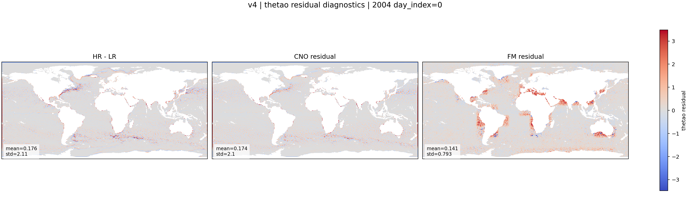

::: {.version-page}
::: {.version-hero}
v4 family

# v4 Family

The v4 family is the first stable CNO-conditioned residual Flow Matching setup. The deterministic CNO predicts the
large-scale HR estimate, and the FM U-Net generates the unresolved residual.
:::

::: {.version-layout}
::: {.version-main}
## What Changed

| Field | Value |
|---|---|
| Deterministic model | CNO v2_loggrad |
| Generative model | U-Net Flow Matching |
| Target | `HR - mu` residual |
| Main question | Which FM choices recover residual energy without artifacts? |
| Inspired by | Conditional Flow Matching, stochastic downscaling, CorrDiff-style residual generation |

## Ablations

| Version | Change | Motivation |
|---|---|---|
| v4_s1_logit_t | logit-normal time sampling | sample more useful intermediate times |
| v4_s2_independent | independent coupling | compare pairing strategy against minibatch OT |
| v4_s3_no_attn | remove attention | measure bottleneck attention effect |
| v4_s4_grad_mu | add CNO gradient | expose fronts and sharp CNO structures |

## Available Local Plot

{.full-figure}


:::

::: {.version-side}
## Family Role

This page summarizes the v4 branch. The detailed ablations are:

- [v4_s1_logit_t](v4_s1_logit_t.html)
- [v4_s2_independent](v4_s2_independent.html)
- [v4_s3_no_attn](v4_s3_no_attn.html)
- [v4_s4_grad_mu](v4_s4_grad_mu.html)
:::
:::
:::
