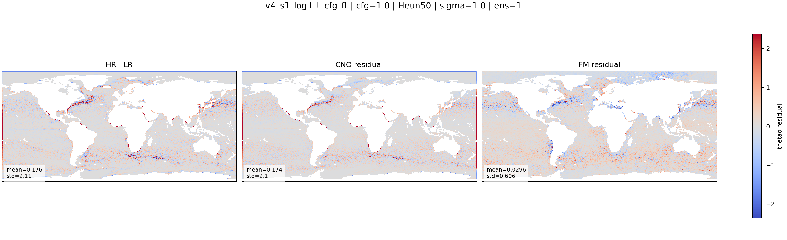
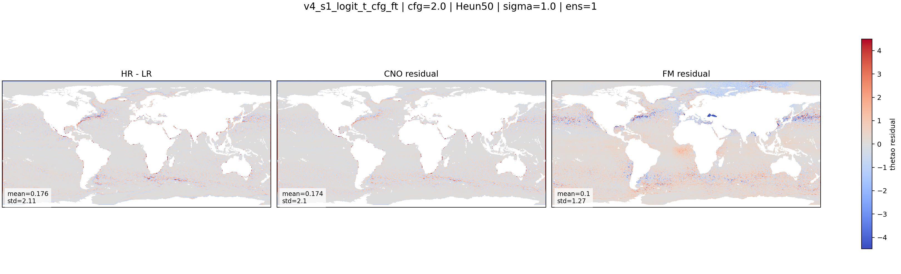

::: {.version-page}
::: {.version-hero}
v4 / fine-tuning

# v4_s1_cfg_ft

This version fine-tunes `v4_s1_logit_t` with condition dropout so the sampler can use classifier-free guidance at
inference time.
:::

::: {.version-layout}
::: {.version-main}
## Hypothesis

During training, the condition is randomly removed for part of the batch. At inference, conditional and
unconditional velocity estimates are combined:

$$
v_{guided}=v_{\emptyset}+w(v_{cond}-v_{\emptyset})
$$

The goal was to push the model away from under-dispersive residuals without retraining the whole architecture.


:::

::: {.version-side}
## Parameters

| Field | Value |
|---|---|
| Init checkpoint | `v4_s1_logit_t` |
| Training change | condition dropout |
| Dropout probability | `0.15` |
| Inference sweep | `cfg_scale` |
| Target | `HR - mu` |

## Inference Used Here

| Parameter | Value |
|---|---|
| Solver | Heun |
| Steps | `50` |
| Sigma | `1.0` |
| Ensemble | `1` |
| CFG shown | `1.0`, `2.0` |

## References

- Classifier-free guidance
- Conditional Flow Matching
:::
:::
:::

::: {.old-version}

## Description

Fine-tuning of `v4_s1_logit_t` with condition dropout to enable classifier-free guidance.

| Field | Value |
|---|---|
| Init checkpoint | `v4_s1_logit_t` |
| Added training change | condition dropout |
| Dropout probability | 0.15 |
| Inference control | `cfg_scale` sweep |
| Motivation | reduce under-dispersion and make FM follow conditioning more strongly |
| Research inspiration | classifier-free guidance in diffusion and flow models |

## Variables

::: {.panel-tabset}
### thetao
::: {.figure-grid}
::: {.figure-slot}
#### CFG 1.0

:::
::: {.figure-slot}
#### CFG 2.0

:::
:::
### so
`assets/figures/v4_s1_cfg_ft/so/`
### zos
`assets/figures/v4_s1_cfg_ft/zos/`
### uo
`assets/figures/v4_s1_cfg_ft/uo/`
### vo
`assets/figures/v4_s1_cfg_ft/vo/`
:::

## Metrics

`assets/metrics/v4_s1_cfg_ft.csv`
:::
