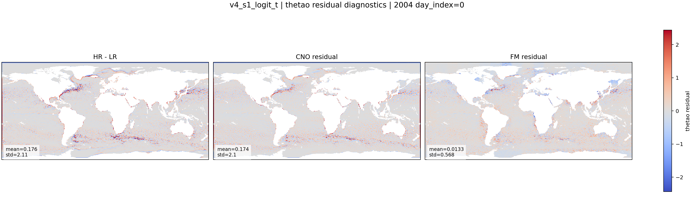
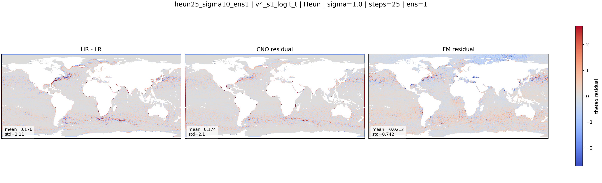
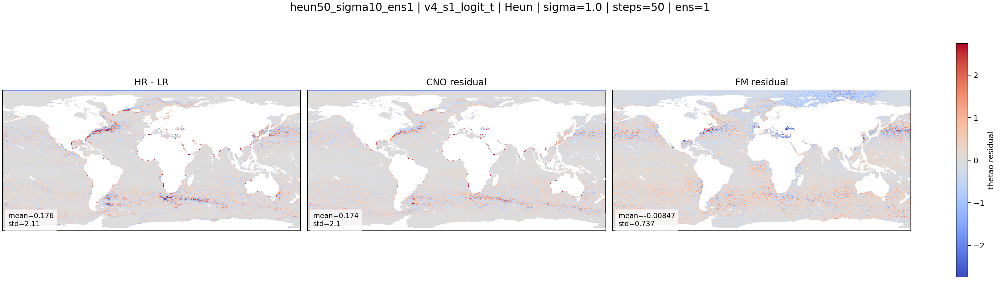

::: {.version-page}
::: {.version-hero}
<span class="version-label">v4 / S1</span>

# v4_s1_logit_t

This is the strongest early residual Flow Matching baseline. I kept the CNO-conditioned U-Net FM setup, but changed
the coupling and time sampling so the model sees more informative training pairs and more useful intermediate times.
:::

::: {.version-layout}
::: {.version-main}
## Hypothesis

The deterministic CNO gives:

$$
\boldsymbol{\mu} = \mathbf{x}_{LR} + f_{\theta}^{CNO}(\mathbf{x}_{LR})
$$

The FM model learns only the missing residual:

$$
\mathbf{x}_1 = \mathbf{x}_{HR} - \boldsymbol{\mu}
$$

For S1, I use [minibatch OT](../methods/minibatch-ot.html) to pair noise and targets:

$$
\pi^{*}=\arg\min_{\pi}\sum_{i,j}\pi_{ij}
\left\|\mathbf{x}_0^i-\mathbf{x}_1^j\right\|_2^2
$$

and [logit-normal time sampling](../methods/logit-normal.html):

$$
u \sim \mathcal{N}(\mu_t,\sigma_t^2),
\qquad
t=\mathrm{sigmoid}(u)
$$

The goal was to improve the training signal around the mixed states where both noise and ocean structure are present.

## Variable Results

::: {.panel-tabset .variable-tabs}
### thetao

#### HR / CNO / CNO+FM

<div class="figure-placeholder-large">Placeholder: thetao HR / CNO / CNO+FM figure. Final PNG will be exported from LIR.</div>

#### HR-LR / CNO residual / FM residual

{.full-figure}

#### CNO error / FM error

<div class="figure-placeholder-large">Placeholder: thetao CNO error / FM error figure.</div>

#### Loss curve

<div class="figure-placeholder-large">Placeholder: TensorBoard train/val loss curve for v4_s1_logit_t.</div>

### so

#### HR / CNO / CNO+FM

<div class="figure-placeholder-large">Placeholder: so HR / CNO / CNO+FM figure.</div>

#### HR-LR / CNO residual / FM residual

<div class="figure-placeholder-large">Placeholder: so HR-LR / CNO residual / FM residual figure.</div>

#### CNO error / FM error

<div class="figure-placeholder-large">Placeholder: so CNO error / FM error figure.</div>

#### Loss curve

<div class="figure-placeholder-large">Placeholder: TensorBoard train/val loss curve for v4_s1_logit_t.</div>

### zos

#### HR / CNO / CNO+FM

<div class="figure-placeholder-large">Placeholder: zos HR / CNO / CNO+FM figure.</div>

#### HR-LR / CNO residual / FM residual

<div class="figure-placeholder-large">Placeholder: zos HR-LR / CNO residual / FM residual figure.</div>

#### CNO error / FM error

<div class="figure-placeholder-large">Placeholder: zos CNO error / FM error figure.</div>

#### Loss curve

<div class="figure-placeholder-large">Placeholder: TensorBoard train/val loss curve for v4_s1_logit_t.</div>

### uo

#### HR / CNO / CNO+FM

<div class="figure-placeholder-large">Placeholder: uo HR / CNO / CNO+FM figure.</div>

#### HR-LR / CNO residual / FM residual

<div class="figure-placeholder-large">Placeholder: uo HR-LR / CNO residual / FM residual figure.</div>

#### CNO error / FM error

<div class="figure-placeholder-large">Placeholder: uo CNO error / FM error figure.</div>

#### Loss curve

<div class="figure-placeholder-large">Placeholder: TensorBoard train/val loss curve for v4_s1_logit_t.</div>

### vo

#### HR / CNO / CNO+FM

<div class="figure-placeholder-large">Placeholder: vo HR / CNO / CNO+FM figure.</div>

#### HR-LR / CNO residual / FM residual

<div class="figure-placeholder-large">Placeholder: vo HR-LR / CNO residual / FM residual figure.</div>

#### CNO error / FM error

<div class="figure-placeholder-large">Placeholder: vo CNO error / FM error figure.</div>

#### Loss curve

<div class="figure-placeholder-large">Placeholder: TensorBoard train/val loss curve for v4_s1_logit_t.</div>
:::

## Loss Curves

::: {.loss-placeholder}
TensorBoard loss curves will be extracted from LIR and placed here:

```text
website/assets/losses/v4_s1_logit_t/
```
:::
:::

::: {.version-side}
## Parameters

| Field | Value |
|---|---|
| CNO checkpoint | `v2_loggrad` |
| FM backbone | U-Net |
| Target | `HR - mu` |
| Coupling | minibatch OT |
| Time sampling | logit-normal |
| Variables | `thetao`, `so`, `zos`, `uo`, `vo` |
| Train years | `1994-2003` |
| Validation | `2004` |
| Batch size | `8` |
| Accumulation | `4` |

## Inference Used Here

| Parameter | Value |
|---|---|
| Solver | Heun |
| Steps | `25` and `50` |
| Sigma | `1.0` |
| Ensemble | `1` |
| Output shown | `thetao` residual maps |

## References

- [Flow Matching](https://arxiv.org/abs/2210.02747)
- [Conditional Flow Matching reference code](https://github.com/g4vrel/CFM)
- OT-CFM / minibatch optimal transport idea
:::
:::
:::

::: {.old-version}

## Description

Best early U-Net Flow Matching baseline. It keeps CNO residual conditioning and changes time sampling to logit-normal.

| Field | Value |
|---|---|
| Architecture | CNO v2_loggrad + U-Net FM |
| Objective | Flow Matching on `HR - mu` |
| Coupling | minibatch OT |
| t sampling | logit-normal |
| Inference baseline | Heun, 25 steps, sigma 1.0 |
| Motivation | improve training signal around informative intermediate times |
| Research inspiration | Conditional Flow Matching, OT-CFM, weather downscaling FM |

## Variables

::: {.panel-tabset}
### thetao

::: {.figure-grid}
::: {.figure-slot}
#### Baseline residual map


:::
::: {.figure-slot}
#### Heun 25, sigma 1.0, ens 1


:::
::: {.figure-slot}
#### Heun 50, sigma 1.0, ens 1


:::
:::

### so

::: {.figure-grid}
::: {.figure-slot}
#### HR / CNO / CNO+FM
`assets/figures/v4_s1_logit_t/so/presentation.png`
:::
::: {.figure-slot}
#### HR-LR / CNO Residual / FM Residual
`assets/figures/v4_s1_logit_t/so/residuals.png`
:::
::: {.figure-slot}
#### CNO Error / FM Error
`assets/figures/v4_s1_logit_t/so/errors.png`
:::
:::

### zos

::: {.figure-grid}
::: {.figure-slot}
#### HR / CNO / CNO+FM
`assets/figures/v4_s1_logit_t/zos/presentation.png`
:::
::: {.figure-slot}
#### HR-LR / CNO Residual / FM Residual
`assets/figures/v4_s1_logit_t/zos/residuals.png`
:::
::: {.figure-slot}
#### CNO Error / FM Error
`assets/figures/v4_s1_logit_t/zos/errors.png`
:::
:::

### uo

::: {.figure-grid}
::: {.figure-slot}
#### HR / CNO / CNO+FM
`assets/figures/v4_s1_logit_t/uo/presentation.png`
:::
::: {.figure-slot}
#### HR-LR / CNO Residual / FM Residual
`assets/figures/v4_s1_logit_t/uo/residuals.png`
:::
::: {.figure-slot}
#### CNO Error / FM Error
`assets/figures/v4_s1_logit_t/uo/errors.png`
:::
:::

### vo

::: {.figure-grid}
::: {.figure-slot}
#### HR / CNO / CNO+FM
`assets/figures/v4_s1_logit_t/vo/presentation.png`
:::
::: {.figure-slot}
#### HR-LR / CNO Residual / FM Residual
`assets/figures/v4_s1_logit_t/vo/residuals.png`
:::
::: {.figure-slot}
#### CNO Error / FM Error
`assets/figures/v4_s1_logit_t/vo/errors.png`
:::
:::
:::

## Metrics

`assets/metrics/v4_s1_logit_t.csv`
:::
