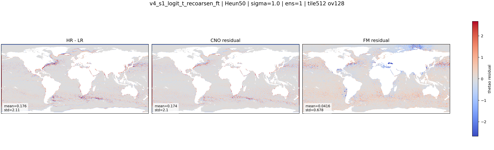

::: {.version-page}
::: {.version-hero}
v4 / fine-tuning

# v4_s1_recoarsen_ft

This version fine-tunes `v4_s1_logit_t` with a coarse-scale consistency constraint. The objective is to keep the
generated HR field compatible with the LR observation after downsampling.
:::

::: {.version-layout}
::: {.version-main}
## Hypothesis

The generated field is:

$$
\widehat{\mathbf{x}}_{HR} = \boldsymbol{\mu} + \widehat{\mathbf{r}}_{FM}
$$

I add a re-coarsening loss:

$$
\mathcal{L}_{coarse}
= \left\| C(\widehat{\mathbf{x}}_{HR}) - \mathbf{x}_{LR}^{native} \right\|_2^2
$$

where `C` is the mask-aware downsampling operator used in the training system with PyTorch average pooling.


:::

::: {.version-side}
## Parameters

| Field | Value |
|---|---|
| Init checkpoint | `v4_s1_logit_t` |
| Added loss | re-coarsening consistency |
| Loss weight | `0.05` |
| Warmup | enabled |
| Target | `HR - mu` |
| Motivation | conserve LR-scale information |

## Inference Used Here

| Parameter | Value |
|---|---|
| Solver | Heun |
| Steps | `50` |
| Sigma | `1.0` |
| Ensemble | `1` |

## References

- Coarse/fine consistency in generative downscaling
- Flow Matching residual formulation
:::
:::
:::

::: {.old-version}

## Description

Fine-tuning of `v4_s1_logit_t` with a re-coarsening consistency loss.
The generated HR field is downsampled and compared to the LR input.

| Field | Value |
|---|---|
| Init checkpoint | `v4_s1_logit_t` |
| Added loss | re-coarsening consistency |
| Weight | 0.05 with warmup |
| Motivation | force HR generation to conserve LR-scale information |
| Research inspiration | re-coarsening consistency in super-resolution/downscaling papers |

## Variables

::: {.panel-tabset}
### thetao
::: {.figure-grid}
::: {.figure-slot}
#### HR-LR / CNO Residual / FM Residual

:::
:::
### so
`assets/figures/v4_s1_recoarsen_ft/so/`
### zos
`assets/figures/v4_s1_recoarsen_ft/zos/`
### uo
`assets/figures/v4_s1_recoarsen_ft/uo/`
### vo
`assets/figures/v4_s1_recoarsen_ft/vo/`
:::

## Metrics

`assets/metrics/v4_s1_recoarsen_ft.csv`
:::
