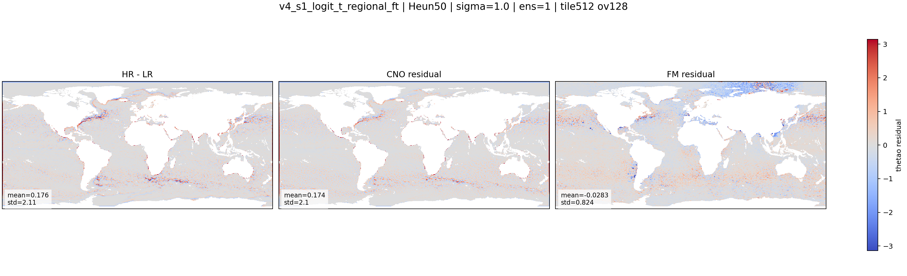

::: {.version-page}
::: {.version-hero}
v4 / fine-tuning

# v4_s1_regional_ft

This version keeps the same architecture but changes the sampling distribution. It oversamples regions that were
visually weak: Mediterranean, Black Sea and Arctic patches.
:::

::: {.version-layout}
::: {.version-main}
## Hypothesis

Uniform patch sampling gives too much probability mass to open-ocean patches. I changed the patch probability:

$$
p(\text{patch}) \propto w_{region}\,\mathbb{1}(f_{ocean}>\tau)
$$

so small or difficult regions appear more often during fine-tuning.


:::

::: {.version-side}
## Parameters

| Field | Value |
|---|---|
| Init checkpoint | `v4_s1_logit_t` |
| Data change | weighted patch sampling |
| Regions | Med, Black Sea, Arctic |
| Region ocean threshold | `0.3` |
| Default weight | `1.0` |
| Med/Black weight | `5.0` |
| Arctic weight | `3.0` |

## Inference Used Here

| Parameter | Value |
|---|---|
| Solver | Heun |
| Steps | `50` |
| Sigma | `1.0` |
| Ensemble | `1` |

## References

- Importance sampling for regional failures
- Residual Flow Matching
:::
:::
:::

::: {.old-version}

## Description

Fine-tuning of `v4_s1_logit_t` with weighted patch sampling for under-represented regions.

| Field | Value |
|---|---|
| Init checkpoint | `v4_s1_logit_t` |
| Data change | weighted regional patch sampling |
| Regions | Mediterranean, Black Sea, Arctic |
| Motivation | reduce regional failures caused by under-sampling |
| Research inspiration | curriculum and importance sampling for regional downscaling |

## Variables

::: {.panel-tabset}
### thetao
::: {.figure-grid}
::: {.figure-slot}
#### HR-LR / CNO Residual / FM Residual

:::
:::
### so
`assets/figures/v4_s1_regional_ft/so/`
### zos
`assets/figures/v4_s1_regional_ft/zos/`
### uo
`assets/figures/v4_s1_regional_ft/uo/`
### vo
`assets/figures/v4_s1_regional_ft/vo/`
:::

## Metrics

`assets/metrics/v4_s1_regional_ft.csv`
:::
