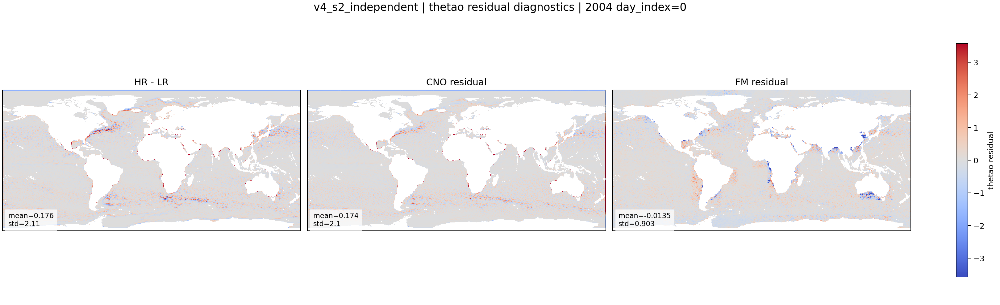

::: {.version-page}
::: {.version-hero}
v4 / S2

# v4_s2_independent

This ablation keeps the same CNO-conditioned U-Net FM as S1, but removes minibatch OT. Noise and residual targets
are paired independently, which tests whether optimal pairing is actually helping residual structure.
:::

::: {.version-layout}
::: {.version-main}
## Hypothesis

The residual target is unchanged:

$$
\mathbf{x}_1=\mathbf{x}_{HR}-\boldsymbol{\mu}.
$$

The only change is the coupling:

$$
(\mathbf{x}_0,\mathbf{x}_1)\sim p_0(\mathbf{x}_0)p_1(\mathbf{x}_1)
$$

instead of solving the [minibatch OT](../methods/minibatch-ot.html) assignment.

## Available Local Plot

{.full-figure}


:::

::: {.version-side}
## Parameters

| Field | Value |
|---|---|
| CNO checkpoint | `v2_loggrad` |
| FM backbone | U-Net |
| Target | `HR - mu` |
| Coupling | independent |
| Time sampling | logit-normal |
| Init | from scratch |

## References

- [Flow Matching](https://arxiv.org/abs/2210.02747)
- Coupling ablation against [minibatch OT](../methods/minibatch-ot.html)
:::
:::
:::
