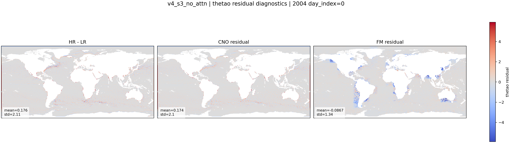

::: {.version-page}
::: {.version-hero}
v4 / S3

# v4_s3_no_attn

This ablation removes the bottleneck attention from the v4 U-Net FM. It tests whether attention is needed to place
the residual energy, or whether convolution alone is enough.
:::

::: {.version-layout}
::: {.version-main}
## Hypothesis

The FM objective is unchanged:

$$
\mathcal{L}_{FM}=\left\|v_\theta(\mathbf{x}_t,t,\boldsymbol{\mu},\mathbf{x}_{LR})-(\mathbf{x}_1-\mathbf{x}_0)\right\|_2^2.
$$

Only the attention block is removed. If the maps lose coherent fronts or eddy placement, the bottleneck attention
was contributing useful spatial coordination.

## Available Local Plot

{.full-figure}


:::

::: {.version-side}
## Parameters

| Field | Value |
|---|---|
| CNO checkpoint | `v2_loggrad` |
| FM backbone | U-Net |
| Ablation | no bottleneck attention |
| Target | `HR - mu` |
| Coupling | minibatch OT |
| Time sampling | logit-normal |

## References

- U-Net attention ablations
- [Flow Matching](https://arxiv.org/abs/2210.02747)
:::
:::
:::
