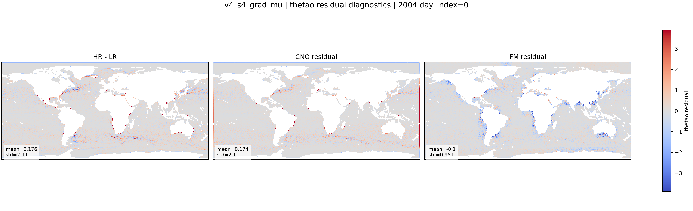

::: {.version-page}
::: {.version-hero}
v4 / S4

# v4_s4_grad_mu

This conditioning ablation adds gradients of the deterministic CNO field. The goal is to expose fronts and sharp
structures already detected by CNO to the FM residual model.
:::

::: {.version-layout}
::: {.version-main}
## Hypothesis

The condition becomes richer:

$$
c=[\boldsymbol{\mu},\mathbf{x}_{LR},\nabla\boldsymbol{\mu}]
$$

instead of only using the coarse/deterministic fields. If FM needs front locations to place residual energy, this
variant should improve coastal and current-front structure.

## Available Local Plot

{.full-figure}


:::

::: {.version-side}
## Parameters

| Field | Value |
|---|---|
| CNO checkpoint | `v2_loggrad` |
| FM backbone | U-Net |
| Added condition | `grad_mu` |
| Target | `HR - mu` |
| Coupling | minibatch OT |
| Time sampling | logit-normal |

## References

- Gradient-informed conditioning
- [Flow Matching](https://arxiv.org/abs/2210.02747)
:::
:::
:::
