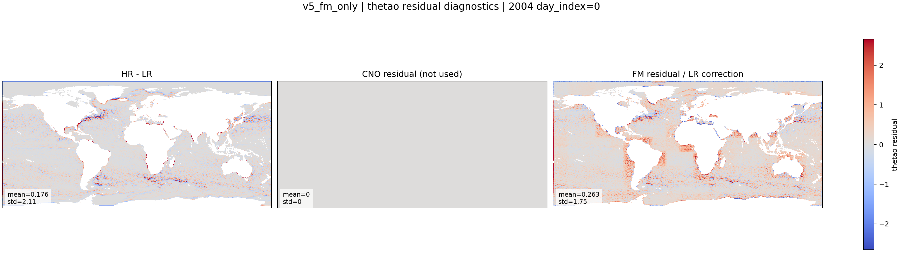

::: {.version-page}
::: {.version-hero}
v5 / FM-only

# v5_fm_only

This version removes the deterministic CNO branch from the generative path and tests how far Flow Matching can go
without the strong CNO mean field. It is a stress test: if FM-only fails, it confirms that the CNO decomposition is
necessary.
:::

::: {.version-layout}
::: {.version-main}
## Hypothesis

The v4 setup decomposes:

$$
\mathbf{x}_{HR}=\boldsymbol{\mu}+\mathbf{r}.
$$

v5 asks whether the generative model can learn the missing field with weaker deterministic support. This is useful as
a baseline against the CNO-conditioned FM family.

## Available Local Plot

{.full-figure}


:::

::: {.version-side}
## Parameters

| Field | Value |
|---|---|
| Family | FM-only ablation |
| Deterministic CNO | removed from main residual path |
| Objective | Flow Matching |
| Purpose | test need for CNO decomposition |
| Status | comparison baseline |

## Interpretation

If v5 is worse than CNO+FM, the decomposition is justified: CNO handles the stable large-scale mean and FM focuses on
the unresolved residual.
:::
:::
:::
