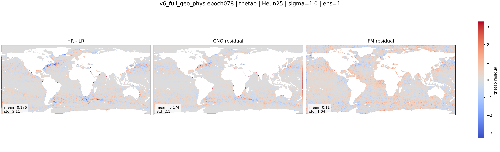

::: {.version-page}
::: {.version-hero}
v6

# v6_full_geo_phys

This version tests whether explicit geographic and physical context can reduce the regional failures observed near
coasts, polar zones and semi-enclosed seas.
:::

::: {.version-layout}
::: {.version-main}
## Hypothesis

The baseline residual model only sees dynamic ocean fields. v6 adds stronger geographic/static context so the model
can condition residual generation on where it is in the ocean:

$$
v_{\theta}(\mathbf{x}_t,t,c),
\qquad
c = [\boldsymbol{\mu}, \mathbf{x}_{LR}, \mathrm{mask}, \mathrm{geo}]
$$

The intention is to make the residual less blind to coastal and polar regimes.


:::

::: {.version-side}
## Parameters

| Field | Value |
|---|---|
| Architecture | CNO-conditioned FM |
| Added context | static/geographic fields |
| Physical idea | coarse consistency |
| Target | residual generation |
| Motivation | polar/coastal failures |

## Inference Used Here

| Parameter | Value |
|---|---|
| Solver | Heun |
| Sigma | `1.0` |
| Output shown | `thetao` residuals |

## References

- Physics-constrained downscaling
- Geospatial conditioning
:::
:::
:::

::: {.old-version}

## Description

Geography and physics-oriented extension of the residual Flow Matching setup.

| Field | Value |
|---|---|
| Architecture | CNO-conditioned FM |
| Added information | geography/static fields and physical consistency terms |
| Motivation | reduce polar, coastal and semi-enclosed sea failures |
| Research inspiration | physics-constrained adaptive FM and geospatial downscaling |

## Variables

::: {.panel-tabset}
### thetao
::: {.figure-grid}
::: {.figure-slot}
#### HR-LR / CNO Residual / FM Residual

:::
:::
### so
`assets/figures/v6_full_geo_phys/so/`
### zos
`assets/figures/v6_full_geo_phys/zos/`
### uo
`assets/figures/v6_full_geo_phys/uo/`
### vo
`assets/figures/v6_full_geo_phys/vo/`
:::

## Metrics

`assets/metrics/v6_full_geo_phys.csv`
:::
