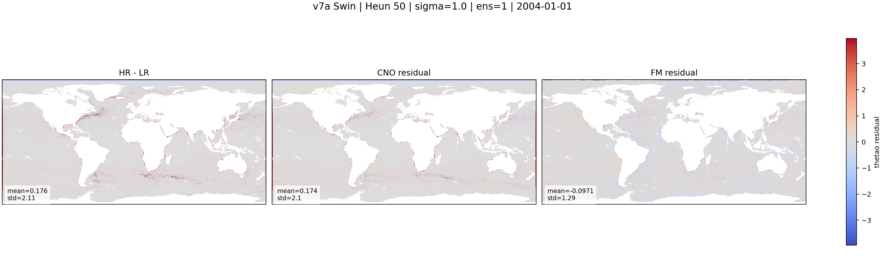

::: {.version-page}
::: {.version-hero}
v7 / local transformer

# v7a_swin

This architecture replaces the U-Net FM backbone with Swin-style local window attention. The question is whether
ocean residuals are better modeled by local attention than by global token mixing.
:::

::: {.version-layout}
::: {.version-main}
## Hypothesis

Most energetic submesoscale structures are local: fronts, eddies and coastal gradients. Swin attention restricts
attention to windows:

$$
\mathrm{Attn}(Q,K,V)=\mathrm{softmax}\left(\frac{QK^\top}{\sqrt{d}}\right)V
$$

but applies it locally, reducing compute while still letting nearby ocean tokens communicate.

## Variable Results

::: {.panel-tabset .variable-tabs}
### thetao

#### HR / CNO / CNO+FM

::: {.figure-placeholder-large}
Placeholder: thetao HR / CNO / CNO+FM figure. Final PNG will be exported from LIR.
:::

#### HR-LR / CNO residual / FM residual

{.full-figure}

#### CNO error / FM error

::: {.figure-placeholder-large}
Placeholder: thetao CNO error / FM error figure.
:::

#### Loss curve

::: {.figure-placeholder-large}
Placeholder: TensorBoard train/val loss curve.
:::

### so

::: {.figure-placeholder-large}
Placeholder: so figures will be exported from LIR.
:::

### zos

::: {.figure-placeholder-large}
Placeholder: zos figures will be exported from LIR.
:::

### uo

::: {.figure-placeholder-large}
Placeholder: uo figures will be exported from LIR.
:::

### vo

::: {.figure-placeholder-large}
Placeholder: vo figures will be exported from LIR.
:::
:::
:::

::: {.version-side}
## Parameters

| Field | Value |
|---|---|
| CNO checkpoint | `v2_loggrad` |
| FM backbone | Swin-style |
| Attention | local windows |
| Target | `HR - mu` |
| Coupling | minibatch OT |
| Time sampling | logit-normal |

## References

- [Swin Transformer](https://arxiv.org/abs/2103.14030)
- [Flow Matching](https://arxiv.org/abs/2210.02747)
:::
:::
:::
