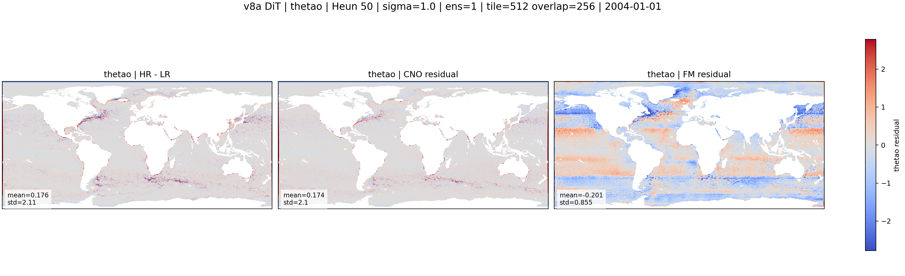
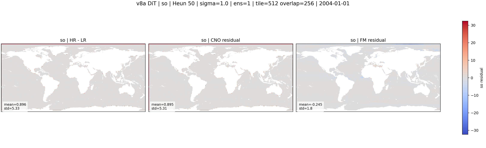
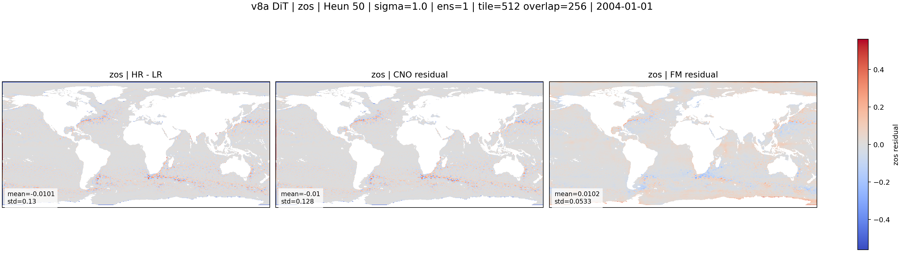
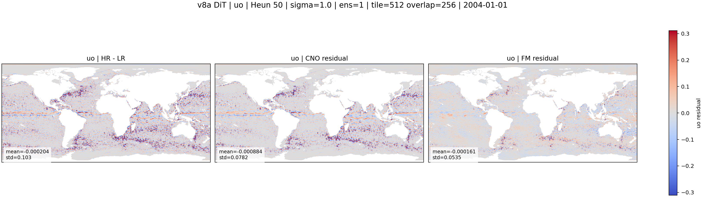

::: {.version-page}
::: {.version-hero}
v8 / pixel DiT

# v8a_dit_pixel

This version replaces the U-Net FM backbone with a pixel-space Diffusion Transformer. It tests whether token attention
can recover structures that the convolutional U-Net misses.
:::

::: {.version-layout}
::: {.version-main}
## Hypothesis

The HR patch is patchified into tokens. Time and conditioning modulate the transformer through AdaLN-style layers:

$$
\mathrm{block}(z,t,c)=z+\gamma(t,c)\,\mathrm{Attn}(\mathrm{LN}(z))+\beta(t,c).
$$

The goal is to test global context for residual energy placement, especially in regions where local tiling produced
horizontal artifacts. The figures currently shown use the best local copy available: `Heun 50`, `sigma=1.0`,
`ensemble=1`, `tile=512`, `overlap=256`.

## Variable Results

::: {.panel-tabset .variable-tabs}
### thetao

#### HR / CNO / CNO+FM

::: {.figure-placeholder-large}
Placeholder: thetao HR / CNO / CNO+FM figure. Final PNG will be exported from LIR.
:::

#### HR-LR / CNO residual / FM residual

{.full-figure}

#### CNO error / FM error

::: {.figure-placeholder-large}
Placeholder: thetao CNO error / FM error figure.
:::

#### Loss curve

::: {.figure-placeholder-large}
Placeholder: TensorBoard train/val loss curve.
:::

### so

#### HR-LR / CNO residual / FM residual

{.full-figure}

### zos

#### HR-LR / CNO residual / FM residual

{.full-figure}

### uo

#### HR-LR / CNO residual / FM residual

{.full-figure}

### vo

#### HR-LR / CNO residual / FM residual

{.full-figure}
:::
:::

::: {.version-side}
## Parameters

| Field | Value |
|---|---|
| CNO checkpoint | `v2_loggrad` |
| FM backbone | pixel DiT |
| Patch size | `4` |
| Embed dim | `384` |
| Depth | `12` |
| Conditioning | concat at patch embed |

## References

- [DiT](https://arxiv.org/abs/2212.09748)
- [Flow Matching](https://arxiv.org/abs/2210.02747)
:::
:::
:::
